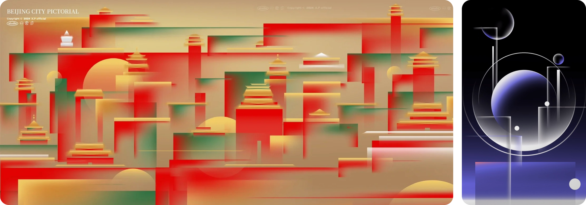
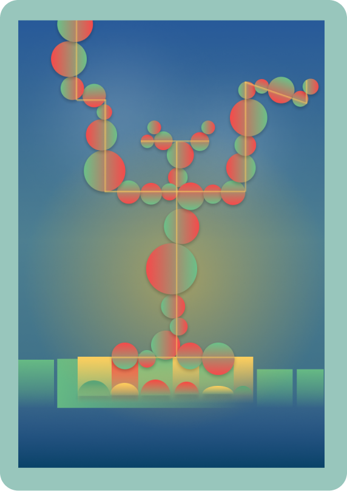
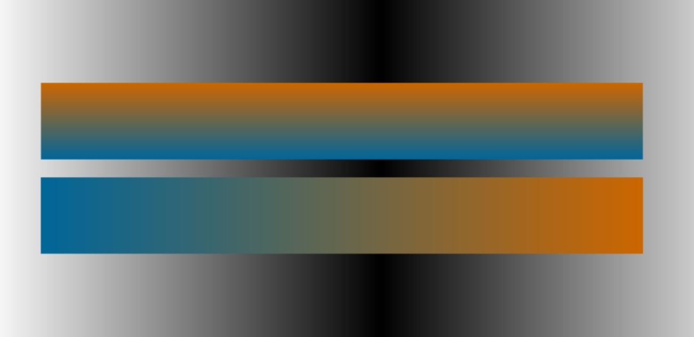
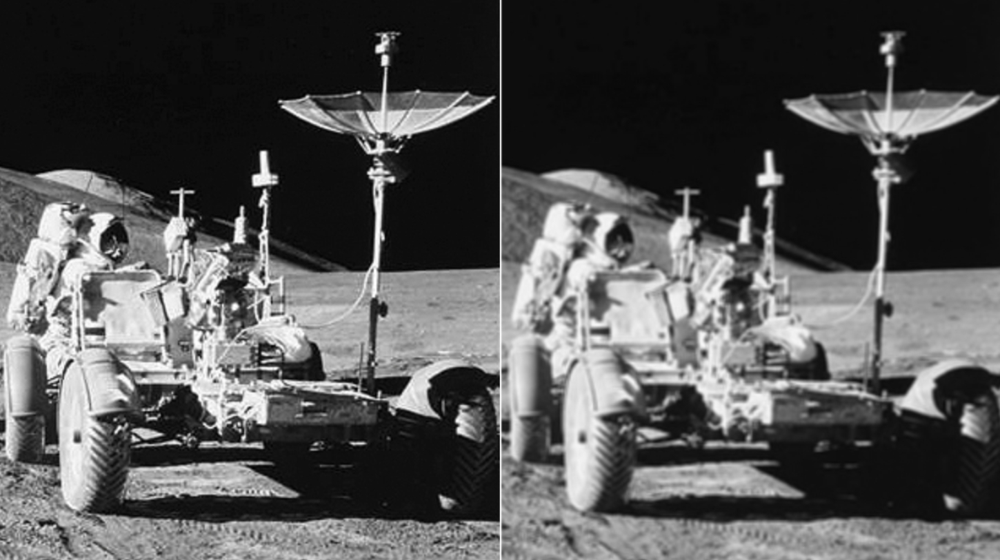

# ysun0714_9103_tut02
> **IDEA9103_Quiz 8** 
# **Part 1: Imaging Technique Inspiration**

_Images by XiaoBaiDesignStudio_

The design of the two posters above has inspired my project choice of drawing the "Apple Tree." The design of the posters are both medium abstract, using basic shapes in layered geometric patterns to depict the cities. Each element features linear colors and opacity gradients, achieving a simple yet visually rich aesthetic with depth. I intend to incorporate these techniques—layered geometric patterns, color gradients, and opacity variations—into my project. This will translate the artwork into a modern digital format while preserving the clean, minimal style of the original piece. Additionally, the geometry and color gradients will provide many possibilities for animation later on.

_A mock up of the visual effect I want to achieve_

[(Back to top)](#part-1-imaging-technique-inspiration)
# **Part 2: Coding Technique Exploration** 
To create a linear gradient color, I will use the lerpColor() function to interpolate between red and green.
[An Example of Linear Gradient from p5js.org](https://archive.p5js.org/examples/color-linear-gradient.html)

 

For the gradient opacity of the shapes, I will utilize the createImage() function. Within this function, I will implement nested loops to iterate over the pixels of the image. 
[An Example of Image Gradient from p5js.org](https://archive.p5js.org/examples/image-create-image.html)

 

In the background, I will draw various shapes and adjust their opacity using alpha values. Additionally, a low-pass filter with the filter() function using the BLUR parameter will be applied. This will enhance the overall composition with a soft, dreamy light effect and allow the foreground elements to stand out. [An Example of Blur Effect from p5js.org](https://archive.p5js.org/examples/image-blur.html).

 

[(Back to top)](#part-1-imaging-technique-inspiration)

